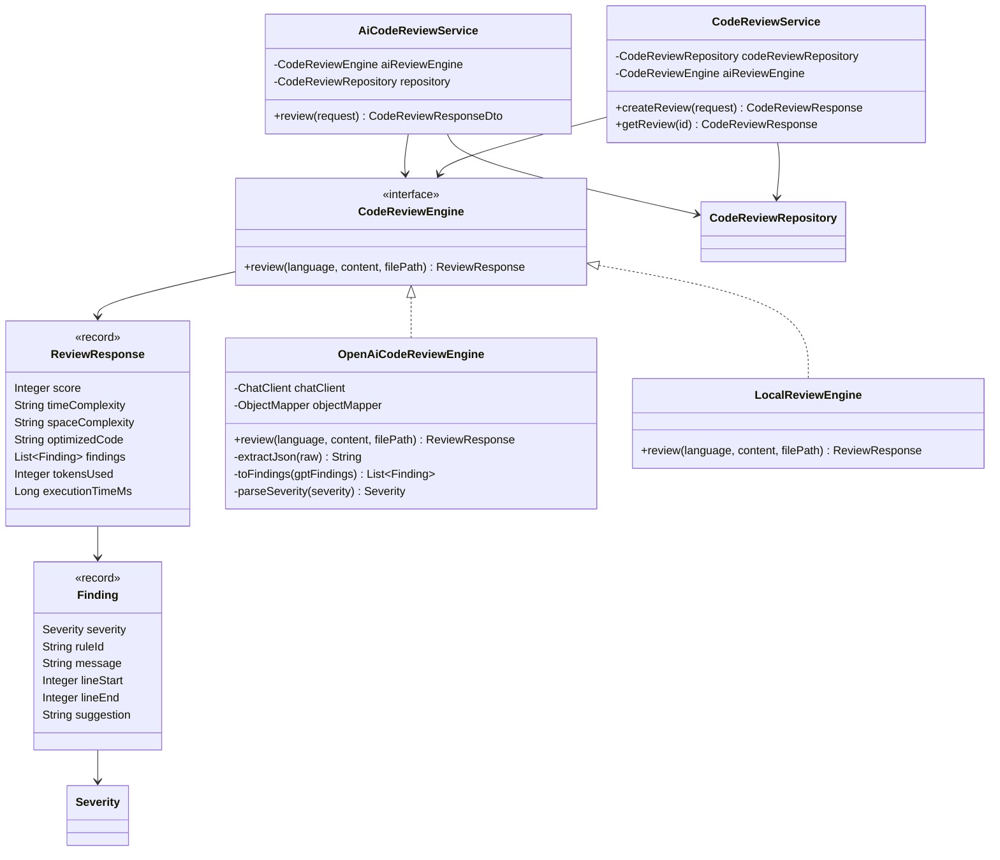
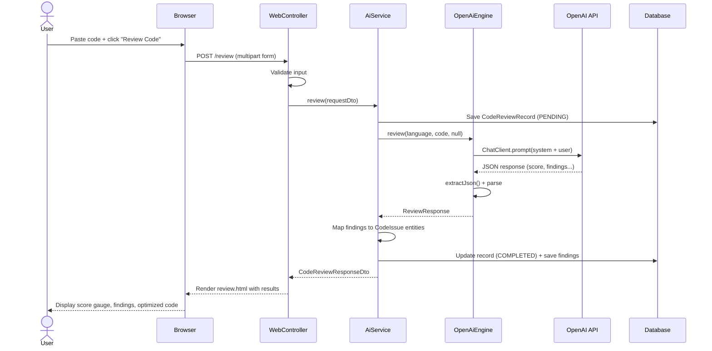

# Low-Level Design (LLD) — AI Code Reviewer

## 1. Package Structure

```
com.rudra.aicodereview
├── CodeReviewAiApplication.java          # Spring Boot entry point
├── controller/
│   ├── HomeController.java               # Redirects / → /review
│   ├── CodeReviewWebController.java      # Thymeleaf UI (review + history)
│   ├── CodeReviewApiController.java      # REST API POST /review (JSON)
│   └── CodeAnalysisController.java       # REST API /api/reviews (CRUD)
├── service/
│   ├── CodeReviewEngine.java             # Strategy interface
│   ├── OpenAiCodeReviewEngine.java       # OpenAI GPT implementation
│   ├── LocalReviewEngine.java            # Offline stub implementation
│   ├── AiCodeReviewService.java          # UI review orchestration
│   └── CodeReviewService.java            # API review orchestration
├── dto/
│   ├── CodeReviewRequestDto.java         # UI review request (language, code)
│   ├── CodeReviewResponseDto.java        # UI review response (score, findings...)
│   ├── AiReviewFinding.java              # Single finding DTO
│   ├── ReviewPageForm.java               # Thymeleaf form backing bean
│   ├── CodeReviewRequest.java            # API review request
│   ├── CodeReviewResponse.java           # API review response
│   └── CodeIssueDto.java                 # API finding DTO
├── entity/
│   ├── CodeReviewRecord.java             # JPA entity — review record
│   ├── CodeIssue.java                    # JPA entity — individual finding
│   ├── CodeReviewStatus.java             # Enum: PENDING, COMPLETED, FAILED
│   ├── Severity.java                     # Enum: INFO, WARNING, ERROR
│   ├── User.java                         # JPA entity — user (future use)
│   ├── SourceCodeSubmission.java         # JPA entity — submission (future use)
│   ├── CodeReviewResult.java             # JPA entity — result (future use)
│   └── ReviewStatus.java                 # Enum (future use)
├── repository/
│   └── CodeReviewRepository.java         # Spring Data JPA repository
└── exception/
    ├── ResourceNotFoundException.java    # 404 exception
    └── GlobalExceptionHandler.java       # @ControllerAdvice error handler
```

---

## 2. Class Diagram



---

## 3. Entity-Relationship Diagram

```mermaid
erDiagram
    CODE_REVIEWS ||--o{ REVIEW_FINDINGS : "has many"
    USERS ||--o{ CODE_SUBMISSIONS : "has many"
    CODE_SUBMISSIONS ||--o| REVIEW_RESULTS : "has one"

    CODE_REVIEWS {
        bigint id PK
        varchar language
        varchar file_path
        clob content
        varchar status
        timestamp created_at
        int score
        varchar time_complexity
        varchar space_complexity
        int tokens_used
        bigint execution_time_ms
    }

    REVIEW_FINDINGS {
        bigint id PK
        bigint code_review_id FK
        varchar severity
        varchar rule_id
        varchar message
        int line_start
        int line_end
        clob suggestion
    }

    USERS {
        bigint id PK
        varchar email UK
        varchar display_name
        timestamp created_at
        timestamp updated_at
    }

    CODE_SUBMISSIONS {
        bigint id PK
        bigint user_id FK
        varchar language
        varchar file_path
        clob content
        timestamp created_at
        timestamp updated_at
    }

    REVIEW_RESULTS {
        bigint id PK
        bigint code_submission_id FK UK
        varchar status
        varchar model
        clob summary
        clob raw_output
        clob optimized_code
        timestamp completed_at
        timestamp created_at
        timestamp updated_at
    }
```

> **Note:** `USERS`, `CODE_SUBMISSIONS`, and `REVIEW_RESULTS` are future-use entities. The active flow uses `CODE_REVIEWS` + `REVIEW_FINDINGS`.

---

## 4. API Endpoints

### Web UI Endpoints (Thymeleaf)

| Method | Path | Description |
|---|---|---|
| `GET` | `/` | Redirects to `/review` |
| `GET` | `/review` | Renders the code review editor page |
| `POST` | `/review` | Submits code for review (multipart form) |
| `GET` | `/review/history` | Renders the review history table |

### REST API Endpoints (JSON)

| Method | Path | Description | Request Body |
|---|---|---|---|
| `POST` | `/review` | Submit code review (JSON) | `CodeReviewRequestDto` |
| `POST` | `/api/reviews` | Create review record | `CodeReviewRequest` |
| `GET` | `/api/reviews/{id}` | Get review by ID | — |

### Request/Response Schemas

#### `POST /review` (JSON API)

**Request:**
```json
{
  "language": "java",
  "code": "public class Main { ... }"
}
```

**Response:**
```json
{
  "summary": "Findings: 1 error(s), 2 warning(s), 0 info.",
  "score": 7,
  "timeComplexity": "O(N)",
  "spaceComplexity": "O(1)",
  "optimizedCode": "// improved code...",
  "findings": [
    {
      "severity": "ERROR",
      "ruleId": "NULL_CHECK",
      "message": "Potential null pointer on line 12",
      "lineStart": 12,
      "lineEnd": 12,
      "suggestion": "Add a null check before accessing the object"
    }
  ]
}
```

---

## 5. AI Engine — Strategy Pattern

The application uses the **Strategy Pattern** to decouple the AI provider:

```
aicodereview.ai.provider = openai  →  OpenAiCodeReviewEngine (active)
aicodereview.ai.provider = stub    →  LocalReviewEngine (fallback)
```

### OpenAI Prompt Design

```
SYSTEM: You are a senior software engineer performing a code review.
        Return ONLY valid JSON matching the schema {...}.

USER:   Review the following code.
        Language: {language}
        File path: {filePath}
        Code: ```{language} {code} ```
```

### Response Parsing Pipeline

```
AI Raw Text
    │
    ▼
extractJson()          ← Strips markdown fences, finds JSON boundaries
    │
    ▼
ObjectMapper.readValue ← Deserializes to GptResponse record
    │
    ▼
toFindings()           ← Maps GptFinding → Finding with severity parsing
    │
    ▼
ReviewResponse         ← Final structured response with score, complexity, findings
```

### Error Handling

If JSON parsing fails, the engine returns a `WARNING` finding with rule `AI_PARSE` containing the raw (truncated) response text, allowing the user to see what the AI returned.

---

## 6. Sequence Diagram — Web Review Flow



---

## 7. Configuration

### `application.yml`

```yaml
spring:
  datasource:
    url: jdbc:h2:mem:aicodereview     # In-memory for dev
  jpa:
    hibernate.ddl-auto: update         # Auto-create tables
  ai:
    openai:
      api-key: ${OPENAI_API_KEY}       # From .env file
      chat.options:
        model: gpt-4o-mini
        temperature: 0.2               # Low for deterministic output
        max-tokens: 4096               # Sufficient for full JSON response

aicodereview:
  ai:
    provider: openai                   # Switch to "stub" for offline

server:
  port: 8081
```

### Profile Switching

| Profile | Database | AI Provider |
|---|---|---|
| `default` | H2 in-memory | OpenAI |
| `mysql` | MySQL 8 | OpenAI |
| `stub` (custom) | H2 in-memory | LocalReviewEngine |

---

## 8. Error Handling Architecture

```
GlobalExceptionHandler (@RestControllerAdvice)
    │
    ├── ResourceNotFoundException  →  404 { status, error, message, timestamp }
    ├── MethodArgumentNotValid     →  400 { status, error, message, timestamp }
    └── Exception (catch-all)      →  500 { status, error, message, timestamp }
```

---

## 9. Frontend Architecture

### Review Page (`/review`)

```
┌──────────────────────────────────────────────────────────┐
│ Activity Bar │        Split Layout                        │
│              │                                            │
│  [Logo]      │  ┌─────────────────┐ ┌──────────────────┐ │
│  [Review]    │  │  Editor Pane     │ │  AI Review Pane   │ │
│  [History]   │  │                  │ │                   │ │
│              │  │  Language Select │ │  Score Gauge      │ │
│              │  │  CodeMirror      │ │  Metrics Pills    │ │
│              │  │  Editor          │ │  Summary          │ │
│              │  │                  │ │  Findings List    │ │
│              │  │  [Upload][Review]│ │  Optimized Code   │ │
│              │  └─────────────────┘ └──────────────────┘ │
└──────────────────────────────────────────────────────────┘
```

### CodeMirror Language Modes

| Language | CodeMirror Mode |
|---|---|
| Java | `text/x-java` |
| Kotlin | `text/x-kotlin` |
| Python | `python` |
| JavaScript | `javascript` |
| TypeScript | `application/typescript` |
| Go | `go` |
| Rust | `rust` |
| C# | `text/x-csharp` |
| C++ | `text/x-c++src` |
| Ruby | `ruby` |

---

## 10. Key Design Decisions

| Decision | Rationale |
|---|---|
| **Strategy Pattern for AI** | Enables easy swap between OpenAI and offline stub without code changes |
| **Server-side rendering (Thymeleaf)** | Simpler deployment, no separate frontend build, good for internal tools |
| **H2 for dev, MySQL for prod** | Zero-setup development, production-grade persistence via profile switching |
| **JSON-only AI prompt** | Avoids markdown parsing issues; `extractJson()` handles edge cases |
| **Record types for DTOs** | Immutable, concise, auto-generates equals/hashCode/toString |
| **`@Transactional` on history** | Prevents `LazyInitializationException` for the findings collection |
| **`max-tokens: 4096`** | Ensures the AI can return a complete response with optimized code |
